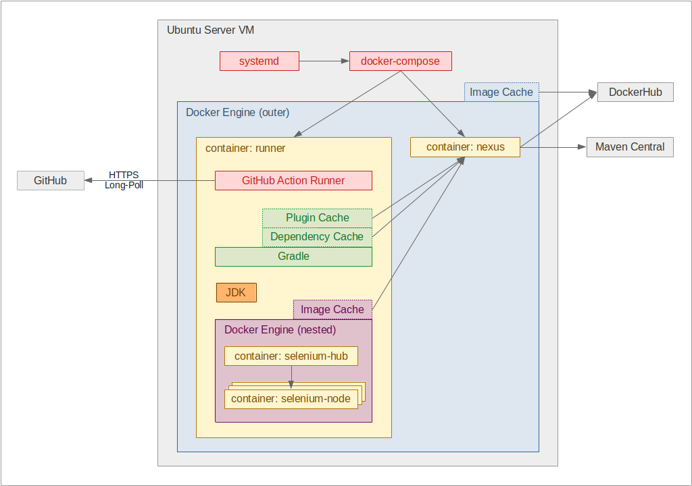

# SoftiCAR GitHub Runner

An ephemeral [GitHub Actions Runner](https://github.com/actions/runner) to build a SoftiCAR Java project in a disposable Docker container.

## 1 Main Features

- Ephemeral [GitHub Actions Runner](https://github.com/actions/runner) in a Docker container which is discarded after each build.
- Unprivileged Docker-in-Docker nesting, aka. _DinD_ (via [Sysbox](https://github.com/nestybox/sysbox); enables [Selenium](https://github.com/SeleniumHQ/selenium) based unit tests in nested Docker containers).
- An integrated cache proxy for build-time resources (via [Sonatype Nexus](https://github.com/sonatype/nexus-public); caches Docker images, Gradle plugins and Gradle dependencies).
- A systemd service to control the life cycle of the runner and cache proxy containers.
- Automatic upgrades to the most recent [GitHub Actions Runner release](https://github.com/actions/runner/releases).

## 2 Prerequisites

The following things are required to set up _SoftiCAR GitHub Runner_ on a VM:

1. Login credentials for the GitHub organization's build-bot user.
   - To create a [GitHub Personal Access Token](https://docs.github.com/en/authentication/keeping-your-account-and-data-secure/creating-a-personal-access-token).
1. Admin access to the repository to build.
   - To add the build-bot user as a member.
1. A DMZ-capable firewall, and permissions to edit its configuration.
   - To set up network isolation.
1. A dedicated Ubuntu 20.04 Server VM.
   - Specs:
     - 20 GB HDD
     - Recommended: 24 CPU threads, 24 GB RAM
     - Minimum: 8 CPU threads, 8 GB RAM
   - Unattended upgrades enabled, for security patches.

## 3 Setup

1. Configure your firewall to isolate the VM from the rest of the network (e.g. via dedicated DMZ). Allow _only:_
   - _Outgoing_ HTTP, HTTPS and SSH connections to the internet.
   - _Incoming_ HTTP and SSH connections from the internal network, for maintenance purposes.
   - Deny all other connections.
1. Log in to the GitHub UI with your personal account:
   - At `Settings` / `Manage Access` of the repository to build, add the build-bot user as an `Admin`.
1. Log in to the VM, as a non-root user.
1. Add a public RSA key in the GitHub UI:
   - If the VM user has an RSA key pair which is also used on another machine, **delete it** and **generate a new one**.
     - Do _not_ reuse an existing key pair for this machine.
     - Delete `id_rsa` and `id_rsa.pub` from `/home/<user>/.ssh/`
     - If existing, delete `id_rsa` and `id_rsa.pub` from `/root/.ssh/` as well.
     - Run `ssh-keygen` to generate a new key pair in `/home/<user>/.ssh/`
   - In the GitHub UI, at `(Build-Bot User Profile)` / `Settings` / `SSH and GPG keys`, add the content of `id_rsa.pub`
1. Install `git`:

       sudo apt install git

1. Clone this repository.
1. Use the setup script to install _all_ required components (i.e. Docker, Docker-Compose, Sysbox, and a Systemd Service):

       ./setup install

   - Answer to various prompts.
   - When prompted for a Personal Access Token (PAT), log in to the GitHub UI with the build-bot account.
   - Head to `(Build-Bot User Profile)` / `Settings` / `Developer settings` / `Personal access tokens`
   - Create a PAT with settings and scopes as described in the terminal prompt.
   - Copy and paste the PAT into the terminal prompt.
1. **Optionally,** copy `softicar-github-runner-service.env-example` to `/home/<user>/.softicar/softicar-github-runner-service.env`
   - Normally, this environment file is _not_ required.
   - Yet, it _can_ be used to override some default settings -- e.g. if a specific [GitHub Actions Runner](https://github.com/actions/runner) version shall be enforced.
   - Refer to the comments in [softicar-github-runner-service.env-example](systemd-service/softicar-github-runner-service.env-example) and [softicar-github-runner-service-docker-compose.yml](systemd-service/softicar-github-runner-service-docker-compose.yml) for details.
1. Reboot the VM.
1. Make sure that the systemd service is `active (running)`:

       ./control.sh status

1. Configure the _nexus_ container as a pull-though cache proxy for build dependencies:
   1. Finish the first-time setup wizard of the _nexus_ container:
      - Look up the default password of the `admin` user in `/var/lib/docker/volumes/nexus-data/_data/admin.password`
      - Navigate to `http://<ip-of-vm>:8081`, and log in with `admin` / `(default-password)`
      - Perform the displayed initialization steps. **Caution:** The default `admin.password` file will be deleted in the process.
   1. Configure a **Docker image proxy:**
      - Head to `Settings` / `Repository` / `Repositories`, click `Create repository`, and select `docker (proxy)`
      - Enter:
        - _Name:_ `docker-hub`
        - _HTTP:_ Enabled, and enter `8123`
        - _Allow anonymous docker pull:_ Enabled
        - _Enable Docker V1 API:_ Enabled (**TODO** try without this)
        - _Proxy / Remote Storage:_ `https://registry-1.docker.io`
        - _Proxy / Docker Index:_ `Use Docker Hub`
      - Click `Create`
      - Head to `Settings` / `Security` / `Realms`
      - Enable `Docker Bearer Token Realm`
      - Click `Save`
   1. Configure a **Gradle plugins proxy:**
      - Head to `Settings` / `Repository` / `Repositories`, click `Create repository`, and select `maven2 (proxy)`
      - Enter:
        - _Name:_ `gradle-plugins`
        - _Maven 2 / Layout policy:_ `Permissive`
        - _Proxy / Remote Storage:_ `https://plugins.gradle.org/m2/`
        - _Storage / Strict Content Type Validation:_ Enabled
      - Click `Create`
   1. Configure a **Gradle dependencies proxy:**
      - Head to `Settings` / `Repository` / `Repositories`, and edit the default `maven-central` repository.
      - Enter:
        - _Maven 2 / Layout policy:_ `Permissive`
        - _Proxy / Remote Storage:_ `https://repo1.maven.org/maven2/`
        - _Storage / Strict Content Type Validation:_ `Disabled` (**TODO** try the default: Enabled)
      - Click `Save`
   1. In the GitHub UI, configure the CI workflow of the project to build:
      - Set `runs-on` to `[self-hosted, ephemeral, dind]`
      - Add parameters to the `run: ./gradlew clean build` command:

            -PpluginProxy=http://nexus:8081/repository/gradle-plugins-proxy/
            -PdependencyProxy=http://nexus:8081/repository/maven-central/

1. In the GitHub UI, under `Settings` / `Actions` / `Runners` of the project to build, make sure that the runner is listed as `Idle`.
1. Make sure that no errors are reported in the output of:

       ./control.sh logs

   You can _follow_ the output with:

       ./control.sh logs -f

   For all available control commands, enter:

       ./control.sh

## 4 Releases and Upgrading

So far, we do not create explicit releases for this project. The `main` branch is assumed to be constantly stable.

To upgrade an existing _SoftiCAR GitHub Runner_ VM, follow these steps:

1. Find the currently-used Personal Access Token (PAT) in `/etc/systemd/system/softicar-github-runner.service`, and copy it to a text editor.
1. Uninstall the service with:

       ./setup uninstall service

   Note that this also stops the service if it's currently running.
1. Stop and remove any remaining "runner" and "nexus" containers:

       docker stop runner nexus
       docker rm runner nexus

3. Update the checkout:

       cd github-runner
       git pull

1. Install the service with:

       ./setup install service

   Use the PAT that you copied to a text editor before.
1. Start the service with:

       ./control start

## 5 Motivation and Goals

### 5.1 Sandboxing

- Pull Requests may contain malicious code that is executed during the Gradle based build of a Java project. This can happen as part of an attack, or by accident.
- On the runner machine, that malicious code is executed with the permissions of the user that runs the build.
- This way, files on the runner machine can be manipulated, and/or available network access can be exploited.
- This enables DOS-, injection-, cache-poisoning- and other kinds of attacks against the runner machine and/or connected machines, unless counter-measures are applied.
- _SoftiCAR GitHub Runner_ therefore sandboxes the build execution. It accepts the fact that the runner machine may get compromised – but it limits the consequences by:
  1. Creating and registering an ephemeral runner in an unprivileged Docker container,
  1. Executing the build on the containerized runner, and
  1. Unregistering and disposing the containerized runner after the build.
- Yet, _SoftiCAR GitHub Runner_ by itself **does not** provide network isolation of builds. This needs to be solved on network infrastructure level.

### 5.2 Efficiency

As a result of the sandboxing approach, the runner containers are disposed after each build, and so are their internal caches.

This would result in Docker images, Gradle plugins and Gradle dependencies being downloaded from the internet for every single build, which would be wasteful in terms of bandwidth and time consumption. To avoid those repeated downloads, said build-time dependencies need to be cached outside the Docker container of the _SoftiCAR GitHub Runner_.

_SoftiCAR GitHub Runner_ therefore employs [Sonatype Nexus](https://github.com/sonatype/nexus-public) as a persistent pull-through cache proxy, in a separate Docker container.

## 6 Architecture

The basic _SoftiCAR GitHub Runner_ architecture is depicted below:

Notes on components:

- `runner` container:
  - Is unprivileged
  - Uses the `sysbox` Docker runtime to enable unprivileged _DinD_
  - Has restricted network access
  - Has no bind-mounts with write access
  - Is disposed and recreated after each build
- `nexus` container:
  - Serves as pull-through cache proxy for build-time resources (i.e. Docker images, Gradle plugins and Gradle dependencies)
  - Avoids repeated downloads after the `runner` container was disposed
- `Docker Engine (nested)`:
  - Runs in an unprivileged container
  - This is enabled via the `sysbox` runtime of the `runner` container

## 7 Limitations

- Each _SoftiCAR GitHub Runner_ VM is configured to build _one_ specific repository.
  - It is _not_ yet possible to configure it as an organization-wide runner, in order to use it for several repositories.
  - This might change in the future.
- This runner implementation is heavily geared towards building SoftiCAR Java projects.
  - It probably won't be useful for other kinds of projects, beyond serving as technical showcase.

## 8 Contributing

Please read the [contribution guidelines](CONTRIBUTING.md) for this repository and keep our [code of conduct](CODE_OF_CONDUCT.md) in mind.

## 9 Related Projects

- [Docker](https://www.docker.com/)
- [Docker-Compose](https://github.com/docker/compose/releases)
- The official [GitHub Actions Runner](https://github.com/actions/runner).
- Kudos to [PasseiDireto/gh-runner](https://github.com/PasseiDireto/gh-runner) which served as a base for the runner container part of this project.
- Further inspiration was drawn from [myoung34/docker-github-actions-runner](https://github.com/myoung34/docker-github-actions-runner).
- [Sysbox](https://github.com/nestybox/sysbox) enables the _unprivileged Docker-in-Docker_ approach.
